```python
#!pip install tqdm
#!pip install progress
#!pip install sklearn
```


```python
import tensorflow as tf
import sys
import math
import os
import numpy as np
import matplotlib
import matplotlib.pyplot as plt
import matplotlib.image as mpimg
import matplotlib.gridspec as gridspec
#import cv2
import dataset_utils
import inception_preprocessing
import inception_v3 as v3


from sklearn.model_selection import train_test_split
from tqdm import tqdm
#from getvector import getvector
from tensorflow.python.platform import gfile
from progress.bar import Bar
from math import floor, ceil, pi
#from PIL import Image

%matplotlib inline


```

# Entrenamiento

## Extracción de características usando InceptionV3

En esta sección se realiza lo siguiente:
- Carga de mamografías según su clase.
- Aumentación de datos


```python
#Vector que extrae las características
def getvector(imagedir, is_training = False, image_type = 'jpg'):
    slim = tf.contrib.slim

    batch_size = 3
    image_size = v3.inception_v3.default_image_size

    url = "http://download.tensorflow.org/models/inception_v3_2016_08_28.tar.gz"
    checkpoints_dir = os.getcwd()

    if not tf.gfile.Exists(checkpoints_dir + '/inception_v3.ckpt'):
        dataset_utils.download_and_uncompress_tarball(url, checkpoints_dir)

    with tf.Graph().as_default():
        # imagedir = '/home/jiexun/Desktop/Siraj/ImageChallenge/Necessary/train/cat.0.jpg'
        image_string = tf.read_file(imagedir)
        
        if (image_type.lower() == 'jpg'):
            image = tf.image.decode_jpeg(image_string, channels=3)
        elif (image_type.lower() == 'png'):
            image = tf.image.decode_png(image_string, channels=3)
        else:
            return None
        
        processed_image = inception_preprocessing.preprocess_image(image, image_size, image_size, is_training)
        processed_images = tf.expand_dims(processed_image, 0)

        # Create the model, use the default arg scope to configure the batch norm parameters.
        #print('Inicializando el modelo InceptionV3...')
        with slim.arg_scope(v3.inception_v3_arg_scope()):
            num_classes=1001
            vector, _ = v3.inception_v3(processed_images, num_classes, is_training)
        
        
        init_fn = slim.assign_from_checkpoint_fn(os.path.join(checkpoints_dir, 'inception_v3.ckpt'),
                                                 slim.get_model_variables('InceptionV3'))
        
        with tf.Session() as sess:
            init_fn(sess)
            np_image, vector = sess.run([image, vector])
            
            plt.imshow(np_image)
            plt.show()
            im = sess.run(processed_image)
            #print(im)
            im = (im * 128 + 128) / 256
            #print(im)
            plt.imshow(im)
            #plt.imshow(im, cmap = 'gray')
            plt.show()
            #img = processed_image.eval()
            #Image.fromarray(np.asarray(img)).show()

        a = np.asarray([x for xs in vector for xss in xs for xsss in xss for x in xsss])
        np.reshape(a, (1, 2048))

    return a


#Procesamiento
data_inputs = []
data_labels = []

# Checking if the 2048-dimensional vector representations of the training images are already available
if os.path.isfile('./data/DM Images/data_inputs.txt') and os.path.isfile('./data/DM Images/data_labels.txt'):
    data_inputs = np.loadtxt('./data/DM Images/data_inputs.txt')
    data_labels = np.loadtxt('./data/DM Images/data_labels.txt')
    print('Datos cargados de un archivo.')

else: 
    #tf.reset_default_graph()
    # add in your images here if you want to train the model on your own images
    data_dir = 'data/DM Images/train'
    
    #Cuenta la cantidad de directorios/clases
    n_classes = 0
    for o in os.listdir(data_dir):
        if not o.startswith('.'):
            n_classes = n_classes + 1
    
    os.environ['TF_CPP_MIN_LOG_LEVEL'] = '3'
    tf.logging.set_verbosity(tf.logging.ERROR)
    
    i_class = 0
    for o in os.listdir(data_dir):
        if not o.startswith('.'):     
            class_name = os.path.join(o)
            print("Clase: ", class_name, "Índice: ",  i_class)

            file_list = []
            file_glob = os.path.join(data_dir, class_name, '*.jpg');
            print('File glob: ', file_glob)
            file_list.extend(gfile.Glob(file_glob))
            print('Samples: ', len(file_list))

            file_list = file_list[0:4]
            #bar = Bar('Inception-V3 is processing images:', max=300)
            #bar = Bar('Inception-V3 is processing images:', max=len(file_list))
            
            one_hot_row = np.zeros(n_classes)             
            one_hot_row[i_class] = 1
            print('one hot: ', one_hot_row)
            
            pbar = tqdm(total=len(file_list))
            pbar.set_description("Inception-V3 is processing %i samples" % len(file_list))
            for file_name in file_list:
                #tqdm.write("Processing:  %s" % file_name)
                #Extrae características
                data_inputs.append(getvector(file_name, True, 'jpg'))
                data_labels.append(one_hot_row)
                
                #bar.next()
                pbar.update(1)
            i_class = i_class + 1
            pbar.close()
    #bar.finish()
    
    os.environ['TF_CPP_MIN_LOG_LEVEL'] = '0'
    tf.logging.set_verbosity(tf.logging.DEBUG)
    
    np.savetxt('data/DM Images/data_inputs.txt', data_inputs)
    np.savetxt('data/DM Images/data_labels.txt', data_labels)
    
    print('Datos grabados en un archivo.')
    


```

    Inception-V3 is processing 4 samples:   0%|          | 0/4 [00:00<?, ?it/s]

    Clase:  Cancer Índice:  0
    File glob:  data/DM Images/train/Cancer/*.jpg
    Samples:  20
    one hot:  [ 1.  0.]


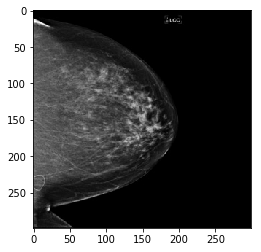


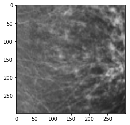


    Inception-V3 is processing 4 samples:  25%|██▌       | 1/4 [00:02<00:08,  2.91s/it]


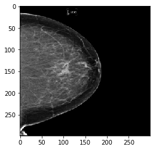


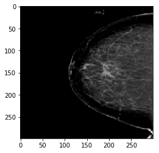


    Inception-V3 is processing 4 samples:  50%|█████     | 2/4 [00:05<00:05,  2.90s/it]


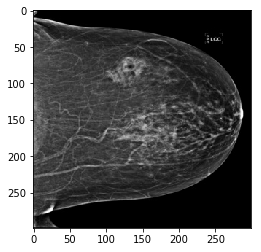


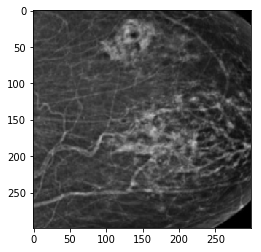


    Inception-V3 is processing 4 samples:  75%|███████▌  | 3/4 [00:08<00:02,  2.91s/it]


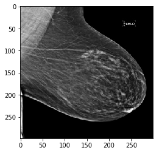


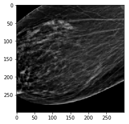


    Inception-V3 is processing 4 samples: 100%|██████████| 4/4 [00:11<00:00,  2.92s/it]
    Inception-V3 is processing 4 samples:   0%|          | 0/4 [00:00<?, ?it/s]

    Clase:  NoCancer Índice:  1
    File glob:  data/DM Images/train/NoCancer/*.jpg
    Samples:  60
    one hot:  [ 0.  1.]


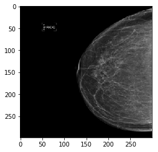


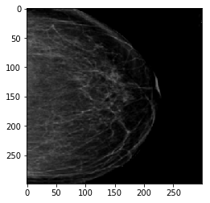


    Inception-V3 is processing 4 samples:  25%|██▌       | 1/4 [00:02<00:08,  2.91s/it]


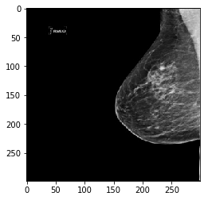


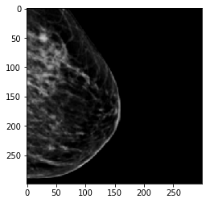


    Inception-V3 is processing 4 samples:  50%|█████     | 2/4 [00:05<00:05,  2.89s/it]


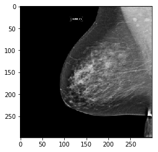


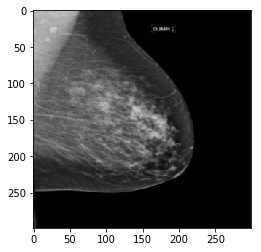


    Inception-V3 is processing 4 samples:  75%|███████▌  | 3/4 [00:08<00:02,  2.89s/it]


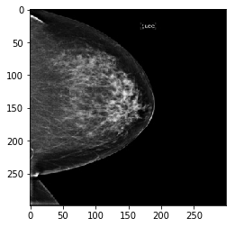


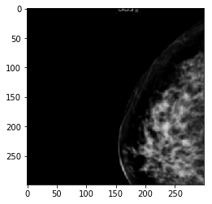


    Inception-V3 is processing 4 samples: 100%|██████████| 4/4 [00:11<00:00,  2.93s/it]

    Datos grabados en un archivo.


    


## Se configuran los parámetros iniciales


```python
# Splitting into train, val, and test
train_inputs, valtest_inputs, train_labels, valtest_labels = train_test_split(data_inputs, data_labels, test_size=0.3, random_state=42)
val_inputs, test_inputs, val_labels, test_labels = train_test_split(valtest_inputs, valtest_labels, test_size=0.4, random_state=43)
```


```python
# Setting hyperparameters
learning_rate = 0.01
batch_size = 64
epochs = 100
log_batch_step = 50
```


```python
# useful info
n_features = np.size(train_inputs, 1)
n_labels = np.size(train_labels, 1)
```


```python
# Placeholders for input features and labels
inputs = tf.placeholder(tf.float32, (None, n_features))
labels = tf.placeholder(tf.float32, (None, n_labels))
```


```python
# Setting up weights and bias
weights = tf.Variable(tf.truncated_normal((n_features, n_labels), stddev=0.1), name='weights')
bias = tf.Variable(tf.zeros(n_labels), name='bias')
tf.add_to_collection('vars', weights)
tf.add_to_collection('vars', bias)
```


```python
# Setting up operation in fully connected layer
logits = tf.add(tf.matmul(inputs, weights), bias)
prediction = tf.nn.softmax(logits)
tf.add_to_collection('pred', prediction)
```


```python
# Defining loss of network
difference = tf.nn.softmax_cross_entropy_with_logits(labels=labels, logits=logits)
loss = tf.reduce_sum(difference)
```


```python
# Setting optimiser
optimizer = tf.train.AdamOptimizer(learning_rate).minimize(loss)
```


```python
# Define accuracy
is_correct_prediction = tf.equal(tf.argmax(prediction, 1), tf.argmax(labels, 1))
accuracy = tf.reduce_mean(tf.cast(is_correct_prediction, tf.float32))

saver = tf.train.Saver((weights, bias))
```

## Carga del modelo Inception

Aquí se debe realizar el transfer learning
(congelar las últimas capas del modelo y entrenar)


```python
# Run tensorflow session
history = {'val_acc':[], 'val_loss':[]}
with tf.Session() as sess:
    init = tf.global_variables_initializer()
    sess.run(init)

    # Running the training in batches 
    batch_count = int(math.ceil(len(train_inputs)/batch_size))

    for epoch_i in range(epochs):
        batches_pbar = tqdm(range(batch_count), desc='Epoch {:>2}/{}'.format(epoch_i+1, epochs), unit='batches')
        # The training cycle
        for batch_i in batches_pbar:
            # Get a batch of training features and labels
            batch_start = batch_i*batch_size
            batch_inputs = train_inputs[batch_start:batch_start + batch_size]
            batch_labels = train_labels[batch_start:batch_start + batch_size]
            # Run optimizer
            _ = sess.run(optimizer, feed_dict={inputs: batch_inputs, labels: batch_labels})

        # Check accuracy against validation data
        val_accuracy, val_loss = sess.run([accuracy, loss], feed_dict={inputs: val_inputs, labels: val_labels})
        history['val_acc'].append(val_accuracy)
        history['val_loss'].append(val_loss)
        
        print("After epoch {}, Loss: {}, Accuracy: {}".format(epoch_i+1, val_loss, val_accuracy))

    g = tf.get_default_graph()
    saver.save(sess, './testsave')
    
```

    Epoch  1/100: 100%|██████████| 1/1 [00:00<00:00, 66.05batches/s]
    Epoch  2/100: 100%|██████████| 1/1 [00:00<00:00, 708.26batches/s]
    Epoch  3/100: 100%|██████████| 1/1 [00:00<00:00, 943.39batches/s]
    Epoch  4/100: 100%|██████████| 1/1 [00:00<00:00, 1098.27batches/s]
    Epoch  5/100: 100%|██████████| 1/1 [00:00<00:00, 1012.14batches/s]
    Epoch  6/100: 100%|██████████| 1/1 [00:00<00:00, 810.96batches/s]
    Epoch  7/100: 100%|██████████| 1/1 [00:00<00:00, 812.85batches/s]
    Epoch  8/100: 100%|██████████| 1/1 [00:00<00:00, 1159.61batches/s]
    Epoch  9/100: 100%|██████████| 1/1 [00:00<00:00, 475.44batches/s]
    Epoch 10/100: 100%|██████████| 1/1 [00:00<00:00, 1028.77batches/s]
    Epoch 11/100: 100%|██████████| 1/1 [00:00<00:00, 963.10batches/s]
    Epoch 12/100: 100%|██████████| 1/1 [00:00<00:00, 1174.22batches/s]
    Epoch 13/100: 100%|██████████| 1/1 [00:00<00:00, 972.48batches/s]
    Epoch 14/100: 100%|██████████| 1/1 [00:00<00:00, 671.52batches/s]
    Epoch 15/100: 100%|██████████| 1/1 [00:00<00:00, 1137.59batches/s]
    Epoch 16/100: 100%|██████████| 1/1 [00:00<00:00, 1253.90batches/s]
    Epoch 17/100: 100%|██████████| 1/1 [00:00<00:00, 1113.43batches/s]
    Epoch 18/100: 100%|██████████| 1/1 [00:00<00:00, 1240.55batches/s]
    Epoch 19/100: 100%|██████████| 1/1 [00:00<00:00, 1471.17batches/s]
    Epoch 20/100: 100%|██████████| 1/1 [00:00<00:00, 1316.07batches/s]
    Epoch 21/100: 100%|██████████| 1/1 [00:00<00:00, 627.42batches/s]
    Epoch 22/100: 100%|██████████| 1/1 [00:00<00:00, 816.01batches/s]
    Epoch 23/100: 100%|██████████| 1/1 [00:00<00:00, 1140.38batches/s]
    Epoch 24/100: 100%|██████████| 1/1 [00:00<00:00, 1091.70batches/s]
    Epoch 25/100: 100%|██████████| 1/1 [00:00<00:00, 1097.41batches/s]
    Epoch 26/100: 100%|██████████| 1/1 [00:00<00:00, 200.91batches/s]
    Epoch 27/100: 100%|██████████| 1/1 [00:00<00:00, 963.10batches/s]
    Epoch 28/100: 100%|██████████| 1/1 [00:00<00:00, 964.21batches/s]
    Epoch 29/100: 100%|██████████| 1/1 [00:00<00:00, 1049.89batches/s]
    Epoch 30/100: 100%|██████████| 1/1 [00:00<00:00, 1230.36batches/s]
    Epoch 31/100: 100%|██████████| 1/1 [00:00<00:00, 799.07batches/s]
    Epoch 32/100: 100%|██████████| 1/1 [00:00<00:00, 902.00batches/s]
    Epoch 33/100: 100%|██████████| 1/1 [00:00<00:00, 1081.28batches/s]
    Epoch 34/100: 100%|██████████| 1/1 [00:00<00:00, 1282.27batches/s]
    Epoch 35/100: 100%|██████████| 1/1 [00:00<00:00, 1172.25batches/s]
    Epoch 36/100: 100%|██████████| 1/1 [00:00<00:00, 314.82batches/s]
    Epoch 37/100: 100%|██████████| 1/1 [00:00<00:00, 1192.58batches/s]
    Epoch 38/100: 100%|██████████| 1/1 [00:00<00:00, 382.73batches/s]
    Epoch 39/100: 100%|██████████| 1/1 [00:00<00:00, 1149.75batches/s]
    Epoch 40/100: 100%|██████████| 1/1 [00:00<00:00, 1310.72batches/s]
    Epoch 41/100: 100%|██████████| 1/1 [00:00<00:00, 505.46batches/s]
    Epoch 42/100: 100%|██████████| 1/1 [00:00<00:00, 197.36batches/s]
    Epoch 43/100: 100%|██████████| 1/1 [00:00<00:00, 1184.16batches/s]
    Epoch 44/100: 100%|██████████| 1/1 [00:00<00:00, 1376.54batches/s]
    Epoch 45/100: 100%|██████████| 1/1 [00:00<00:00, 588.67batches/s]
    Epoch 46/100: 100%|██████████| 1/1 [00:00<00:00, 992.73batches/s]
    Epoch 47/100: 100%|██████████| 1/1 [00:00<00:00, 203.78batches/s]
    Epoch 48/100: 100%|██████████| 1/1 [00:00<00:00, 1122.07batches/s]
    Epoch 49/100: 100%|██████████| 1/1 [00:00<00:00, 843.92batches/s]
    Epoch 50/100: 100%|██████████| 1/1 [00:00<00:00, 956.95batches/s]
    Epoch 51/100: 100%|██████████| 1/1 [00:00<00:00, 428.87batches/s]
    Epoch 52/100: 100%|██████████| 1/1 [00:00<00:00, 1160.25batches/s]
    Epoch 53/100: 100%|██████████| 1/1 [00:00<00:00, 1215.04batches/s]
    Epoch 54/100: 100%|██████████| 1/1 [00:00<00:00, 776.72batches/s]
    Epoch 55/100: 100%|██████████| 1/1 [00:00<00:00, 1195.98batches/s]
    Epoch 56/100: 100%|██████████| 1/1 [00:00<00:00, 471.38batches/s]
    Epoch 57/100: 100%|██████████| 1/1 [00:00<00:00, 1085.48batches/s]
    Epoch 58/100: 100%|██████████| 1/1 [00:00<00:00, 1257.29batches/s]
    Epoch 59/100: 100%|██████████| 1/1 [00:00<00:00, 1261.07batches/s]
    Epoch 60/100: 100%|██████████| 1/1 [00:00<00:00, 703.15batches/s]
    Epoch 61/100: 100%|██████████| 1/1 [00:00<00:00, 472.07batches/s]

    After epoch 1, Loss: 102.91301727294922, Accuracy: 0.2857142984867096
    After epoch 2, Loss: 20.505325317382812, Accuracy: 0.2857142984867096
    After epoch 3, Loss: 31.026878356933594, Accuracy: 0.7142857313156128
    After epoch 4, Loss: 56.10248565673828, Accuracy: 0.7142857313156128
    After epoch 5, Loss: 70.9191665649414, Accuracy: 0.7142857313156128
    After epoch 6, Loss: 77.92278289794922, Accuracy: 0.7142857313156128
    After epoch 7, Loss: 78.72476959228516, Accuracy: 0.7142857313156128
    After epoch 8, Loss: 74.45983123779297, Accuracy: 0.7142857313156128
    After epoch 9, Loss: 65.96660614013672, Accuracy: 0.7142857313156128
    After epoch 10, Loss: 53.887596130371094, Accuracy: 0.7142857313156128
    After epoch 11, Loss: 38.72953796386719, Accuracy: 0.7142857313156128
    After epoch 12, Loss: 20.960649490356445, Accuracy: 0.7142857313156128
    After epoch 13, Loss: 8.191530227661133, Accuracy: 0.7142857313156128
    After epoch 14, Loss: 31.222354888916016, Accuracy: 0.2857142984867096
    After epoch 15, Loss: 29.24835968017578, Accuracy: 0.2857142984867096
    After epoch 16, Loss: 9.42536735534668, Accuracy: 0.5714285969734192
    After epoch 17, Loss: 13.757842063903809, Accuracy: 0.7142857313156128
    After epoch 18, Loss: 23.792818069458008, Accuracy: 0.7142857313156128
    After epoch 19, Loss: 29.807403564453125, Accuracy: 0.7142857313156128
    After epoch 20, Loss: 31.854610443115234, Accuracy: 0.7142857313156128
    After epoch 21, Loss: 30.30635643005371, Accuracy: 0.7142857313156128
    After epoch 22, Loss: 25.522968292236328, Accuracy: 0.7142857313156128
    After epoch 23, Loss: 17.937026977539062, Accuracy: 0.7142857313156128
    After epoch 24, Loss: 9.3763427734375, Accuracy: 0.7142857313156128
    After epoch 25, Loss: 10.328584671020508, Accuracy: 0.5
    After epoch 26, Loss: 15.766778945922852, Accuracy: 0.2857142984867096
    After epoch 27, Loss: 10.108537673950195, Accuracy: 0.5
    After epoch 28, Loss: 8.578417778015137, Accuracy: 0.7142857313156128
    After epoch 29, Loss: 14.194189071655273, Accuracy: 0.7142857313156128
    After epoch 30, Loss: 18.526012420654297, Accuracy: 0.7142857313156128
    After epoch 31, Loss: 19.69771957397461, Accuracy: 0.7142857313156128
    After epoch 32, Loss: 17.786296844482422, Accuracy: 0.7142857313156128
    After epoch 33, Loss: 13.497859001159668, Accuracy: 0.7142857313156128
    After epoch 34, Loss: 8.947395324707031, Accuracy: 0.7142857313156128
    After epoch 35, Loss: 7.9565205574035645, Accuracy: 0.7142857313156128
    After epoch 36, Loss: 9.48676872253418, Accuracy: 0.5
    After epoch 37, Loss: 8.472652435302734, Accuracy: 0.6428571343421936
    After epoch 38, Loss: 7.951933860778809, Accuracy: 0.7142857313156128
    After epoch 39, Loss: 10.470846176147461, Accuracy: 0.7142857313156128
    After epoch 40, Loss: 13.628022193908691, Accuracy: 0.7142857313156128
    After epoch 41, Loss: 15.422014236450195, Accuracy: 0.7142857313156128
    After epoch 42, Loss: 15.24479866027832, Accuracy: 0.7142857313156128
    After epoch 43, Loss: 13.383369445800781, Accuracy: 0.7142857313156128
    After epoch 44, Loss: 10.770379066467285, Accuracy: 0.7142857313156128
    After epoch 45, Loss: 8.662635803222656, Accuracy: 0.7142857313156128
    After epoch 46, Loss: 7.8444132804870605, Accuracy: 0.7142857313156128
    After epoch 47, Loss: 7.829009056091309, Accuracy: 0.7142857313156128
    After epoch 48, Loss: 7.814335346221924, Accuracy: 0.7142857313156128
    After epoch 49, Loss: 8.164963722229004, Accuracy: 0.7142857313156128
    After epoch 50, Loss: 9.383515357971191, Accuracy: 0.7142857313156128
    After epoch 51, Loss: 11.112003326416016, Accuracy: 0.7142857313156128
    After epoch 52, Loss: 12.65188980102539, Accuracy: 0.7142857313156128
    After epoch 53, Loss: 13.484577178955078, Accuracy: 0.7142857313156128
    After epoch 54, Loss: 13.418892860412598, Accuracy: 0.7142857313156128
    After epoch 55, Loss: 12.583375930786133, Accuracy: 0.7142857313156128
    After epoch 56, Loss: 11.327812194824219, Accuracy: 0.7142857313156128
    After epoch 57, Loss: 10.06513500213623, Accuracy: 0.7142857313156128
    After epoch 58, Loss: 9.111112594604492, Accuracy: 0.7142857313156128
    After epoch 59, Loss: 8.580591201782227, Accuracy: 0.7142857313156128
    After epoch 60, Loss: 8.414127349853516, Accuracy: 0.7142857313156128


    
    Epoch 62/100: 100%|██████████| 1/1 [00:00<00:00, 683.22batches/s]
    Epoch 63/100: 100%|██████████| 1/1 [00:00<00:00, 1217.50batches/s]
    Epoch 64/100: 100%|██████████| 1/1 [00:00<00:00, 1226.40batches/s]
    Epoch 65/100: 100%|██████████| 1/1 [00:00<00:00, 434.06batches/s]
    Epoch 66/100: 100%|██████████| 1/1 [00:00<00:00, 986.66batches/s]
    Epoch 67/100: 100%|██████████| 1/1 [00:00<00:00, 1096.55batches/s]
    Epoch 68/100: 100%|██████████| 1/1 [00:00<00:00, 1236.89batches/s]
    Epoch 69/100: 100%|██████████| 1/1 [00:00<00:00, 419.68batches/s]
    Epoch 70/100: 100%|██████████| 1/1 [00:00<00:00, 789.89batches/s]
    Epoch 71/100: 100%|██████████| 1/1 [00:00<00:00, 973.16batches/s]
    Epoch 72/100: 100%|██████████| 1/1 [00:00<00:00, 463.51batches/s]
    Epoch 73/100: 100%|██████████| 1/1 [00:00<00:00, 483.33batches/s]
    Epoch 74/100: 100%|██████████| 1/1 [00:00<00:00, 476.35batches/s]
    Epoch 75/100: 100%|██████████| 1/1 [00:00<00:00, 1371.58batches/s]
    Epoch 76/100: 100%|██████████| 1/1 [00:00<00:00, 1414.61batches/s]
    Epoch 77/100: 100%|██████████| 1/1 [00:00<00:00, 1136.05batches/s]
    Epoch 78/100: 100%|██████████| 1/1 [00:00<00:00, 1360.02batches/s]
    Epoch 79/100: 100%|██████████| 1/1 [00:00<00:00, 476.46batches/s]
    Epoch 80/100: 100%|██████████| 1/1 [00:00<00:00, 1500.11batches/s]
    Epoch 81/100: 100%|██████████| 1/1 [00:00<00:00, 1634.57batches/s]
    Epoch 82/100: 100%|██████████| 1/1 [00:00<00:00, 1132.68batches/s]
    Epoch 83/100: 100%|██████████| 1/1 [00:00<00:00, 1206.30batches/s]
    Epoch 84/100: 100%|██████████| 1/1 [00:00<00:00, 1285.02batches/s]
    Epoch 85/100: 100%|██████████| 1/1 [00:00<00:00, 396.85batches/s]
    Epoch 86/100: 100%|██████████| 1/1 [00:00<00:00, 446.92batches/s]
    Epoch 87/100: 100%|██████████| 1/1 [00:00<00:00, 882.27batches/s]
    Epoch 88/100: 100%|██████████| 1/1 [00:00<00:00, 1233.98batches/s]
    Epoch 89/100: 100%|██████████| 1/1 [00:00<00:00, 1198.37batches/s]
    Epoch 90/100: 100%|██████████| 1/1 [00:00<00:00, 453.49batches/s]
    Epoch 91/100: 100%|██████████| 1/1 [00:00<00:00, 1464.49batches/s]
    Epoch 92/100: 100%|██████████| 1/1 [00:00<00:00, 985.97batches/s]
    Epoch 93/100: 100%|██████████| 1/1 [00:00<00:00, 1434.93batches/s]
    Epoch 94/100: 100%|██████████| 1/1 [00:00<00:00, 461.47batches/s]
    Epoch 95/100: 100%|██████████| 1/1 [00:00<00:00, 438.14batches/s]
    Epoch 96/100: 100%|██████████| 1/1 [00:00<00:00, 1032.83batches/s]
    Epoch 97/100: 100%|██████████| 1/1 [00:00<00:00, 754.10batches/s]
    Epoch 98/100: 100%|██████████| 1/1 [00:00<00:00, 1352.56batches/s]
    Epoch 99/100: 100%|██████████| 1/1 [00:00<00:00, 1546.00batches/s]
    Epoch 100/100: 100%|██████████| 1/1 [00:00<00:00, 1308.27batches/s]


    After epoch 61, Loss: 8.53575325012207, Accuracy: 0.7142857313156128
    After epoch 62, Loss: 8.94619369506836, Accuracy: 0.7142857313156128
    After epoch 63, Loss: 9.638973236083984, Accuracy: 0.7142857313156128
    After epoch 64, Loss: 10.507454872131348, Accuracy: 0.7142857313156128
    After epoch 65, Loss: 11.366718292236328, Accuracy: 0.7142857313156128
    After epoch 66, Loss: 12.02990436553955, Accuracy: 0.7142857313156128
    After epoch 67, Loss: 12.368867874145508, Accuracy: 0.7142857313156128
    After epoch 68, Loss: 12.343917846679688, Accuracy: 0.7142857313156128
    After epoch 69, Loss: 12.00398063659668, Accuracy: 0.7142857313156128
    After epoch 70, Loss: 11.461174964904785, Accuracy: 0.7142857313156128
    After epoch 71, Loss: 10.851468086242676, Accuracy: 0.7142857313156128
    After epoch 72, Loss: 10.296791076660156, Accuracy: 0.7142857313156128
    After epoch 73, Loss: 9.88046932220459, Accuracy: 0.7142857313156128
    After epoch 74, Loss: 9.64169692993164, Accuracy: 0.7142857313156128
    After epoch 75, Loss: 9.586751937866211, Accuracy: 0.7142857313156128
    After epoch 76, Loss: 9.704261779785156, Accuracy: 0.7142857313156128
    After epoch 77, Loss: 9.970943450927734, Accuracy: 0.7142857313156128
    After epoch 78, Loss: 10.347803115844727, Accuracy: 0.7142857313156128
    After epoch 79, Loss: 10.778181076049805, Accuracy: 0.7142857313156128
    After epoch 80, Loss: 11.194929122924805, Accuracy: 0.7142857313156128
    After epoch 81, Loss: 11.533943176269531, Accuracy: 0.7142857313156128
    After epoch 82, Loss: 11.747804641723633, Accuracy: 0.7142857313156128
    After epoch 83, Loss: 11.814773559570312, Accuracy: 0.7142857313156128
    After epoch 84, Loss: 11.741121292114258, Accuracy: 0.7142857313156128
    After epoch 85, Loss: 11.556827545166016, Accuracy: 0.7142857313156128
    After epoch 86, Loss: 11.306622505187988, Accuracy: 0.7142857313156128
    After epoch 87, Loss: 11.039379119873047, Accuracy: 0.7142857313156128
    After epoch 88, Loss: 10.798858642578125, Accuracy: 0.7142857313156128
    After epoch 89, Loss: 10.617788314819336, Accuracy: 0.7142857313156128
    After epoch 90, Loss: 10.515644073486328, Accuracy: 0.7142857313156128
    After epoch 91, Loss: 10.499232292175293, Accuracy: 0.7142857313156128
    After epoch 92, Loss: 10.564453125, Accuracy: 0.7142857313156128
    After epoch 93, Loss: 10.698053359985352, Accuracy: 0.7142857313156128
    After epoch 94, Loss: 10.879395484924316, Accuracy: 0.7142857313156128
    After epoch 95, Loss: 11.0828218460083, Accuracy: 0.7142857313156128
    After epoch 96, Loss: 11.281027793884277, Accuracy: 0.7142857313156128
    After epoch 97, Loss: 11.449052810668945, Accuracy: 0.7142857313156128
    After epoch 98, Loss: 11.568037033081055, Accuracy: 0.7142857313156128
    After epoch 99, Loss: 11.627835273742676, Accuracy: 0.7142857313156128
    After epoch 100, Loss: 11.627948760986328, Accuracy: 0.7142857313156128


## Métricas


```python
print(history)

import pandas as pd
import matplotlib.pyplot as plt
%matplotlib inline

df = pd.DataFrame(history)
#display(df)

df.plot(y=['val_loss'], figsize=(16,4), title='Loss')
df.plot(y=['val_acc'], figsize=(16,4), title='Accuracy');
```

    /home/grupoavatar/.local/lib/python3.5/site-packages/pandas/plotting/_core.py:1714: UserWarning: Pandas doesn't allow columns to be created via a new attribute name - see https://pandas.pydata.org/pandas-docs/stable/indexing.html#attribute-access
      series.name = label


    {'val_loss': [102.91302, 20.505325, 31.026878, 56.102486, 70.919167, 77.922783, 78.72477, 74.459831, 65.966606, 53.887596, 38.729538, 20.960649, 8.1915302, 31.222355, 29.24836, 9.4253674, 13.757842, 23.792818, 29.807404, 31.85461, 30.306356, 25.522968, 17.937027, 9.3763428, 10.328585, 15.766779, 10.108538, 8.5784178, 14.194189, 18.526012, 19.69772, 17.786297, 13.497859, 8.9473953, 7.9565206, 9.4867687, 8.4726524, 7.9519339, 10.470846, 13.628022, 15.422014, 15.244799, 13.383369, 10.770379, 8.6626358, 7.8444133, 7.8290091, 7.8143353, 8.1649637, 9.3835154, 11.112003, 12.65189, 13.484577, 13.418893, 12.583376, 11.327812, 10.065135, 9.1111126, 8.5805912, 8.4141273, 8.5357533, 8.9461937, 9.6389732, 10.507455, 11.366718, 12.029904, 12.368868, 12.343918, 12.003981, 11.461175, 10.851468, 10.296791, 9.8804693, 9.6416969, 9.5867519, 9.7042618, 9.9709435, 10.347803, 10.778181, 11.194929, 11.533943, 11.747805, 11.814774, 11.741121, 11.556828, 11.306623, 11.039379, 10.798859, 10.617788, 10.515644, 10.499232, 10.564453, 10.698053, 10.879395, 11.082822, 11.281028, 11.449053, 11.568037, 11.627835, 11.627949], 'val_acc': [0.2857143, 0.2857143, 0.71428573, 0.71428573, 0.71428573, 0.71428573, 0.71428573, 0.71428573, 0.71428573, 0.71428573, 0.71428573, 0.71428573, 0.71428573, 0.2857143, 0.2857143, 0.5714286, 0.71428573, 0.71428573, 0.71428573, 0.71428573, 0.71428573, 0.71428573, 0.71428573, 0.71428573, 0.5, 0.2857143, 0.5, 0.71428573, 0.71428573, 0.71428573, 0.71428573, 0.71428573, 0.71428573, 0.71428573, 0.71428573, 0.5, 0.64285713, 0.71428573, 0.71428573, 0.71428573, 0.71428573, 0.71428573, 0.71428573, 0.71428573, 0.71428573, 0.71428573, 0.71428573, 0.71428573, 0.71428573, 0.71428573, 0.71428573, 0.71428573, 0.71428573, 0.71428573, 0.71428573, 0.71428573, 0.71428573, 0.71428573, 0.71428573, 0.71428573, 0.71428573, 0.71428573, 0.71428573, 0.71428573, 0.71428573, 0.71428573, 0.71428573, 0.71428573, 0.71428573, 0.71428573, 0.71428573, 0.71428573, 0.71428573, 0.71428573, 0.71428573, 0.71428573, 0.71428573, 0.71428573, 0.71428573, 0.71428573, 0.71428573, 0.71428573, 0.71428573, 0.71428573, 0.71428573, 0.71428573, 0.71428573, 0.71428573, 0.71428573, 0.71428573, 0.71428573, 0.71428573, 0.71428573, 0.71428573, 0.71428573, 0.71428573, 0.71428573, 0.71428573, 0.71428573, 0.71428573]}


    /home/grupoavatar/.local/lib/python3.5/site-packages/pandas/plotting/_core.py:1714: UserWarning: Pandas doesn't allow columns to be created via a new attribute name - see https://pandas.pydata.org/pandas-docs/stable/indexing.html#attribute-access
      series.name = label


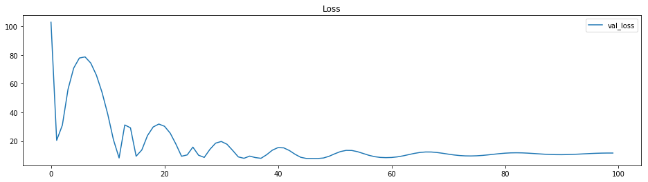


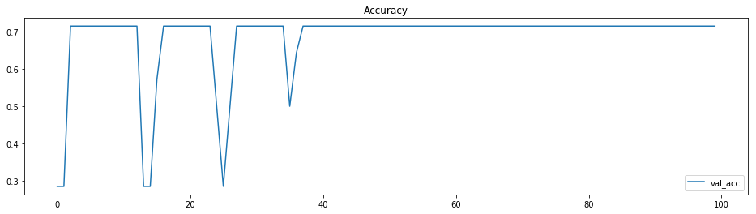


## Pruebas unitarias


```python
def predict(prediction, file_name = 'cat.jpg'):
    #try: 
    #    file_name = 'cat.jpg'
    #except IndexError:
    #    print ('please enter image file path.........')
    #    exit()
    image_input = getvector(file_name).reshape((1,2048))
    #if 'cat' in file_name:
    #    image_label = [[1, 0]]
    #else:
    #    image_label = [[0, 1]]

    with tf.Session() as sess:
        new_saver = tf.train.import_meta_graph('testsave.meta')
        new_saver.restore(sess, tf.train.latest_checkpoint('./'))

        pred = sess.run(prediction, feed_dict={inputs: image_input})

        return pred
```


```python
import matplotlib.pyplot as plt
import matplotlib.image as mpimg

pred = predict(prediction, 'data/DM Images/validation/Cancer/337671.jpg')
print('Predict: Cancer/337671.jpg\n', )
img=mpimg.imread('data/DM Images/validation/Cancer/337671.jpg')
imgplot = plt.imshow(img)
plt.show()
print ('Cancer: {}, NoCancer: {}'.format(pred[0][0], pred[0][1]))
print('\n\n\n')

pred = predict(prediction, 'data/DM Images/validation/NoCancer/288567.jpg')
print('Predict: NoCancer/288567.jpg\n', )
img=mpimg.imread('data/DM Images/validation/NoCancer/288567.jpg')
imgplot = plt.imshow(img)
plt.show()
print ('Cancer: {}, NoCancer: {}'.format(pred[0][0], pred[0][1]))

```

    INFO:tensorflow:Restoring parameters from /home/grupoavatar/inf659-inception/transfer_learning/inception_v3.ckpt


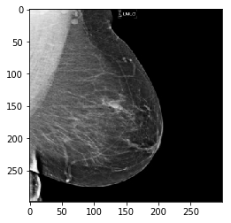


    INFO:tensorflow:Restoring parameters from ./testsave
    Predict: Cancer/337671.jpg
    


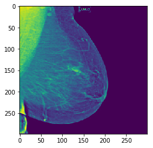


    Cancer: 0.020510157570242882, NoCancer: 0.9794898629188538
    
    
    
    
    INFO:tensorflow:Restoring parameters from /home/grupoavatar/inf659-inception/transfer_learning/inception_v3.ckpt


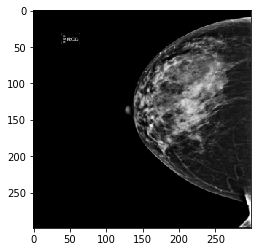


    INFO:tensorflow:Restoring parameters from ./testsave
    Predict: NoCancer/288567.jpg
    


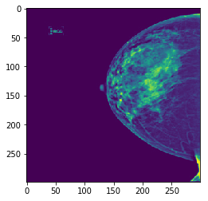


    Cancer: 0.013263460248708725, NoCancer: 0.9867364764213562

